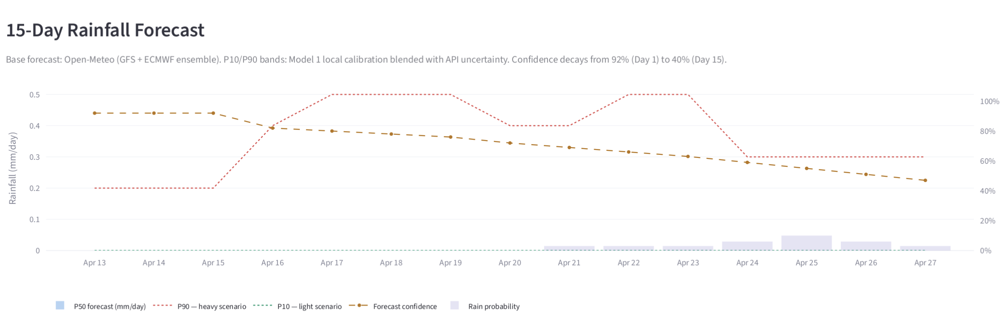
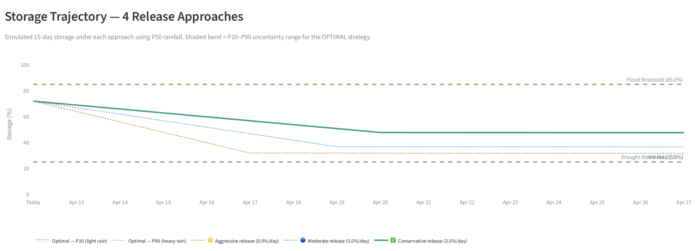

# 💧 Decision Support System for Bisalpur Reservoir

> **A cognitive, ML-powered water management platform for real-time flood & drought risk assessment at Bisalpur Reservoir, Rajasthan, India.**

[](https://www.python.org/)
[](https://streamlit.io/)
[](https://lightgbm.readthedocs.io/)
[](https://open-meteo.com/)
[](LICENSE)

---

## 📌 Overview

Bisalpur Reservoir (capacity: **1,076 MCM**) is the primary drinking water source for ~7 million people across Jaipur, Ajmer, and Tonk districts in Rajasthan. Managing its release decisions — especially during monsoon season — requires balancing flood prevention upstream against maintaining minimum reserves for drinking water downstream.

This project implements a **cognitively-inspired Decision Support System (DSS)** that mirrors the mental model of an expert reservoir operator: it synthesises live weather intelligence, locally-calibrated ML forecasts, and rule-based risk constraints to generate **ranked, explainable release strategies** in real time.

> 📄 This system is grounded in research on cognitive decision-making frameworks applied to water resource management. The architecture reflects how expert operators mentally decompose the decision problem — perceiving current state, forecasting near futures, evaluating options under uncertainty, and applying hard safety constraints before committing to action.

---

## 🧠 Cognitive Architecture

The system is designed around the **Recognition-Primed Decision (RPD)** model — a cognitive theory describing how experienced professionals make decisions under uncertainty and time pressure. Rather than evaluating all possible options exhaustively, the system:

1. **Perceives** the current reservoir state (live storage %, live weather)
2. **Anticipates** near-future scenarios via probabilistic forecasting (P10 / P50 / P90)
3. **Evaluates** a structured option set (4 named release protocols) rather than a continuous search space
4. **Applies hard constraints** (minimum storage floor, maximum gate capacity) as cognitive "veto rules" — options that violate them are eliminated before scoring
5. **Communicates uncertainty** explicitly through trajectory bands and two-layer alerts

This mirrors how expert dam operators reason: they don't optimise over infinite strategies — they select from a small, trusted protocol set, adjusted by live conditions.

```
                         ┌─────────────────────────────────────┐
                         │       COGNITIVE DECISION LOOP        │
                         └─────────────────────────────────────┘

  PERCEIVE              FORECAST              EVALUATE             ACT
  ─────────            ─────────────         ──────────────       ──────────────
  Live storage   →     Open-Meteo 15d   →    4 release        →   Ranked
  (WRIS / CSV)         GFS+ECMWF              protocols            strategies
                              │                    │
  Live weather   →     Model 1 (LightGBM)  Hard constraints    Two-layer alerts
  (Open-Meteo)         local bias correction   veto filter      Day-by-day plan
                              │
                        P10 / P50 / P90
                        uncertainty bands
```

---

## 🏗️ System Architecture

.png)

### Pipeline

```
Open-Meteo API  ────────────────────────────────────────────────────┐
 (free · no key · 15-day GFS+ECMWF ensemble · updated every 6h)     │
                                                                      ▼
Historical Data (2010–2025)                               ┌──────────────────┐
 ├── Rainfall (NASA POWER API)                            │   Risk Engine    │
 ├── Temperature & Humidity                               │                  │
 └── Reservoir Storage (India WRIS)                       │ 4 release        │
         │                                                │ approaches       │
         ▼                                                │ Water balance    │
 ┌────────────────┐   Model Output Statistics             │ simulation       │
 │ Model 1        │ ◄── (MOS blending: Day 1-7 = 90%    │ Flood/drought    │
 │ LightGBM       │      API, Day 8-15 = 85% Model 1)   │ scoring          │
 │ Rainfall bias  │                                       │ Hard constraint  │
 │ corrector      │ ──► P10 / P50 / P90 bands ──────────►│ filter           │
 └────────────────┘                                       │ Ranking          │
                                                          └────────┬─────────┘
 ┌────────────────┐                                               │
 │ Model 2        │                                               ▼
 │ LightGBM       │                                    ┌──────────────────────┐
 │ Storage        │ ──► 7-day ahead storage ──────────►│  Streamlit Dashboard │
 │ predictor      │     P10 / P50 / P90                │                      │
 └────────────────┘                                    │  · 15-day rain chart │
                                                        │  · Storage trajectory│
 India WRIS / CSV fallback                              │  · 4 ranked options  │
 ──► Current storage (auto-loaded) ───────────────────►│  · Day-by-day plan   │
                                                        │  · Two-layer alerts  │
                                                        └──────────────────────┘
```

---

## 📊 Dashboard Preview

### 15-Day Rainfall Forecast


*P10/P90 uncertainty bands (dotted) blended from Open-Meteo GFS+ECMWF and Model 1 local calibration. Forecast confidence decays from 92% (Day 1) to 40% (Day 15).*

### Storage Trajectory — 4 Release Strategies


*Simulated 15-day storage under each of the 4 named release protocols. Shaded green band = P10–P90 uncertainty range for the OPTIMAL strategy. Red/amber dashed lines = flood and drought thresholds.*


## ⚙️ Features

| Feature | Description |
|---|---|
| 🌦️ **Live 15-day forecast** | Open-Meteo GFS+ECMWF ensemble — no API key required |
| 🧠 **Local calibration (MOS)** | Model 1 (LightGBM) corrects global forecast bias for Bisalpur's terrain |
| 📈 **P10/P50/P90 forecasting** | Probabilistic uncertainty bands for both rainfall and storage |
| 💧 **Water balance simulation** | `S(t+1) = S(t) + Inflow(t) − Release(t) − Evaporation(t)` |
| 🎯 **4 ranked release protocols** | Conservative / Moderate / Aggressive / Emergency — auto-ranked by composite risk |
| 🚨 **Two-layer alert system** | Layer 1: current-state thresholds · Layer 2: trajectory crossing warnings |
| 🔒 **Hard safety constraints** | Min 25% storage floor, max 12%/day gate release — never overridden by ML |
| 📅 **Day-by-day schedule** | Actionable 15-day release plan for the optimal strategy |
| 📡 **Auto storage loading** | WRIS live API → local CSV fallback → manual slider |
| 📜 **3-year historical context** | Compare today's storage with same month in previous years |

---

## 🚀 Getting Started

### Prerequisites

- Python 3.9+
- ~300 MB disk space (for models after training)

### Installation

```bash
# Clone the repository
git clone https://github.com/PrateekG93/Decision-Support-System-DSS-for-Bisalpur-Reservoir.git
cd Decision-Support-System-DSS-for-Bisalpur-Reservoir

# Create virtual environment
python -m venv venv
source venv/bin/activate        # Windows: venv\Scripts\activate

# Install dependencies
pip install -r requirements.txt
```

### Run Order

```bash
# Step 1: Prepare & clean data (~5 seconds)
python step1_prepare_data.py

# Step 2: Train both ML models (~5–8 minutes)
python step2_train_models.py

# Step 3: Launch the dashboard
streamlit run dashboard.py
# Open http://localhost:8501
```

> **Note:** Steps 1 and 2 only need to be run once. After that, just run `streamlit run dashboard.py`.

---

## 📁 Project Structure

```
bisalpur-reservoir-dss/
├── dashboard.py              ← Streamlit dashboard (main entry point)
├── weather_api.py            ← Open-Meteo integration + Model 1 blending
├── risk_engine.py            ← Release strategies, water balance, risk scoring
├── storage_fetcher.py        ← WRIS live API → CSV fallback → default
├── step1_prepare_data.py     ← Data loading, merging & cleaning
├── step2_train_models.py     ← Train Model 1 (rainfall) + Model 2 (storage)
├── requirements.txt          ← Python dependencies
│
├── data/
│   └── raw/                  ← Historical CSVs (included, 2010–2025)
│       ├── Rainfall_Daily.csv
│       ├── Temp_and_Humidity_Daily.csv
│       └── Yearwise_Storage_data.csv
│
├── models/                   ← Generated by step2 (not in repo — run locally)
│   ├── rainfall_model.pkl    ← Model 1: LightGBM quantile regressor
│   ├── storage_model.pkl     ← Model 2: LightGBM quantile regressor
│   ├── rainfall_meta.json    ← Model 1 accuracy metrics
│   └── storage_meta.json     ← Model 2 accuracy metrics
│
├── plots/                    ← Generated by step2
│   ├── rainfall_model_eval.png
│   └── storage_model_eval.png
│
├── architecture (1).png      ← System architecture diagram
├── rainfall_forecast.png     ← Dashboard screenshot
└── storage_trajectory.png    ← Dashboard screenshot
```

---

## 🤖 ML Models

### Model 1 — Rainfall Bias Corrector (LightGBM Quantile Regression)

Implements **Model Output Statistics (MOS)** — the same technique used by national weather services to correct global forecast biases for specific locations.

- **Why it exists:** Open-Meteo forecasts for a 28km × 28km grid cell. Bisalpur sits in specific Rajasthan terrain with its own local rainfall patterns. 15 years of local data teaches the model how much the global forecast typically over/under-predicts here.
- **Input:** Rainfall lag features (1–14 days), rolling stats, humidity, temperature, seasonal cyclical encodings, soil moisture proxy
- **Output:** P10 / P50 / P90 rainfall bands
- **Blending:** API dominates Days 1–7 (90→70% weight); Model 1 dominates Days 8–15 (60→85% weight)

### Model 2 — Storage Predictor (LightGBM Quantile Regression)

- **Task:** 7-day ahead reservoir storage prediction
- **Input:** Storage lags (1–30 days), trends, rainfall lags, temperature, humidity, seasonal features
- **Output:** P10 / P50 / P90 storage trajectories
- **Target metrics:** R² > 0.85, P10–P90 coverage ~80%, flood zone recall > 70%

---

## 🧮 Risk Engine

### Water Balance Equation

```
S(t+1) = S(t) + Inflow(t) − Release(t) − Evaporation(t)

where:
  Inflow(t)     = rainfall_mm × catchment_area_km² × runoff_coeff / 1000
  Evaporation   = f(surface_area, monthly_evaporation_rate)
  Release(t)    = min(protocol_pct × capacity, max_gate_pct × capacity)
```

### 4 Release Protocols

| Protocol | Rate | Active Days | Use When |
|---|---|---|---|
| **Conservative** | 3%/day | High-confidence days only | Storage < 75% OR low forecast confidence |
| **Moderate** | 5%/day | 7 days | Storage 75–88% |
| **Aggressive** | 8%/day | 5 days | Storage > 88% AND high-confidence heavy rain |
| **Emergency** | 12%/day | 4 days | Storage > 95% ONLY |

### Hard Constraints (never overridden by ML)

- **Minimum storage floor:** 25% of capacity — never release below this (drinking water reserve)
- **Maximum gate rate:** 12%/day — structural limit on release speed

### Alert System — Two Layers

| Layer | Type | Description |
|---|---|---|
| **Layer 1** | Current-state | Fires immediately when storage crosses fixed thresholds |
| **Layer 2** | Trajectory-based | Fires when P50/P90 trajectory will cross a threshold in N days |

Layer 2 is the smarter alert — it warns *before* the crossing happens, giving operators time to act.

---

## 📡 Data Sources

| Source | Data | Coverage | Access |
|---|---|---|---|
| [India WRIS](https://indiawris.gov.in/wris/#/Reservoirs) | Reservoir storage | Daily, live | Public API (auto-fetched) |
| [NASA POWER API](https://power.larc.nasa.gov/) | Rainfall, temperature, humidity | 2010–2025 | Free, no key |
| [Open-Meteo](https://open-meteo.com/) | 15-day weather forecast | GFS+ECMWF | Free, no API key |

> ✅ **This project uses zero paid APIs and zero secret credentials.** All data sources are free and open.

---

## 📚 Research Background

This system is developed as part of a cognitive science research project examining how **cognitive frameworks can be embedded into automated decision support systems** for high-stakes water resource management.

Key cognitive principles applied:

- **Recognition-Primed Decision (RPD) Model** — The system provides a small, curated option set rather than a continuous optimisation space, matching how expert operators actually decide
- **Naturalistic Decision Making (NDM)** — Hard constraints represent "experience-based veto rules" that experts apply intuitively
- **Uncertainty communication** — P10/P50/P90 bands make forecast uncertainty explicit, supporting calibrated human trust in the system
- **Two-layer alerts** — Separates *current state* awareness from *anticipatory* awareness, matching the cognitive distinction between situational awareness and mental simulation

> 📄 The accompanying research paper (*"Cognitive Approaches to Decision Support in Reservoir Management"*) provides the theoretical foundation for this architecture.

---

## 🔧 Configuration

Key constants in `risk_engine.py` (adjust for other reservoirs):

```python
CAPACITY_MCM      = 1076.0   # Bisalpur full capacity
MIN_STORAGE_PCT   = 25.0     # Drinking water safety floor
MAX_GATE_PCT_DAY  = 12.0     # Structural gate limit
FLOOD_THRESHOLD   = 85.0     # Flood alert threshold (%)
DROUGHT_THRESHOLD = 25.0     # Drought alert threshold (%)
CATCHMENT_KM2     = 4800     # Bisalpur catchment area
RUNOFF_COEFF      = 0.25     # Runoff coefficient
```

---

## 📋 Requirements

```
lightgbm>=4.0.0
scikit-learn>=1.3.0
pandas>=2.0.0
numpy>=1.24.0
matplotlib>=3.7.0
streamlit>=1.28.0
plotly>=5.17.0
joblib>=1.3.0
statsmodels>=0.14.0
requests>=2.31.0
```

---

## 🤝 Contributing

Pull requests are welcome. For major changes, please open an issue first to discuss what you would like to change.

---

## 📄 License

This project is licensed under the MIT License — see the [LICENSE](LICENSE) file for details.

---

## 👤 Author

**Prateek Goswami**  
[GitHub](https://github.com/PrateekG93)

---

<p align="center">
  <em>Built as a research prototype · Bisalpur Reservoir, Ganga Basin, Rajasthan, India</em><br>
  <em>Open-Meteo + LightGBM + Water Balance Simulation + Cognitive Decision Framework</em>
</p>
